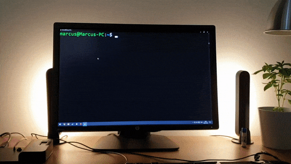

# Hue Terminal exit-code
Do not even ask how i came up with this.



## Usage
1. Install the requirements:
    * Python3
    * Request
2. Run the script once with the `--setup`-flag.

3. Edit you `.bashrc`-file and insert:
    ```bash
    PROMPT_COMMAND=__hue_prompt

    __hue_prompt() {
            local EXIT=$?
            (python3 /path/to/repo/hue-exitcode/script.py --exit_code $EXIT &)
    }
    ```

4. Try it with simple commands as:
    * `ls` - will flash green
    * `wasd` - will flash red (not a command)
